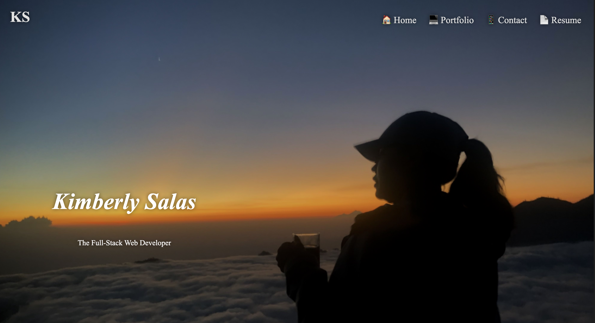
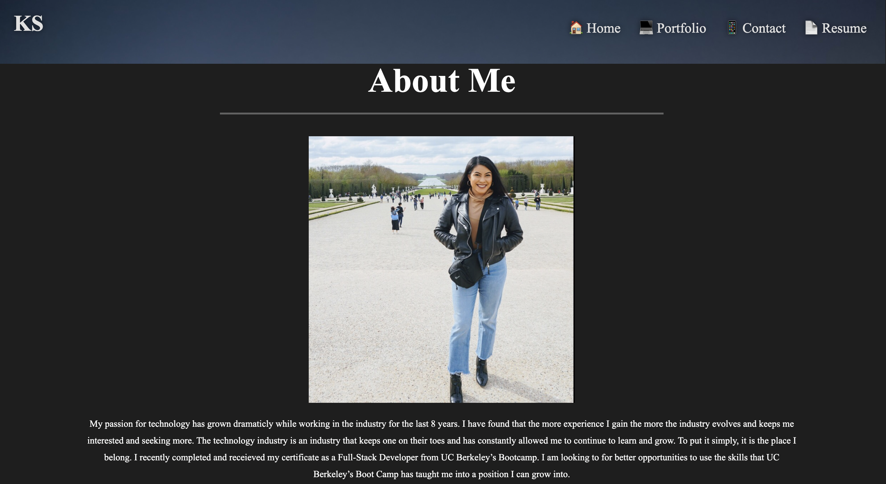
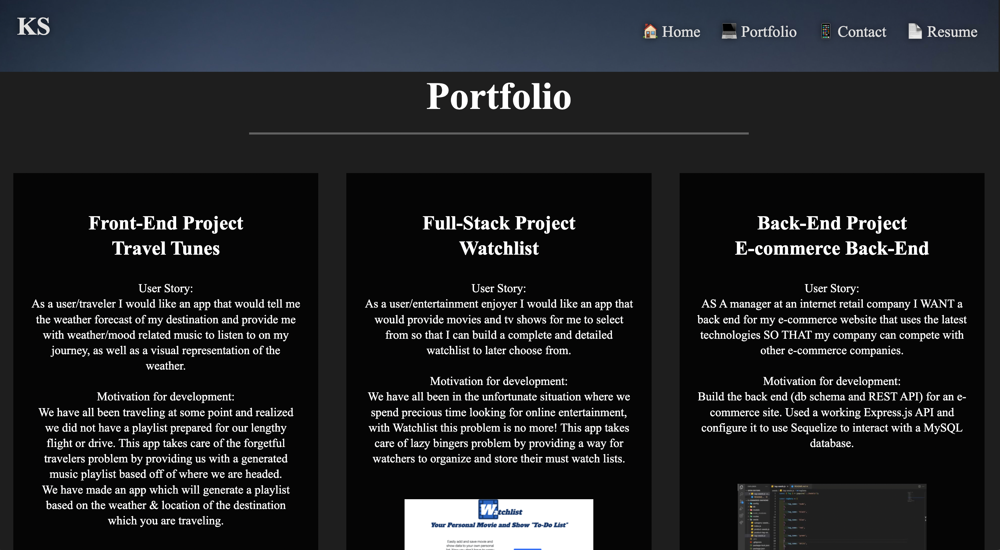
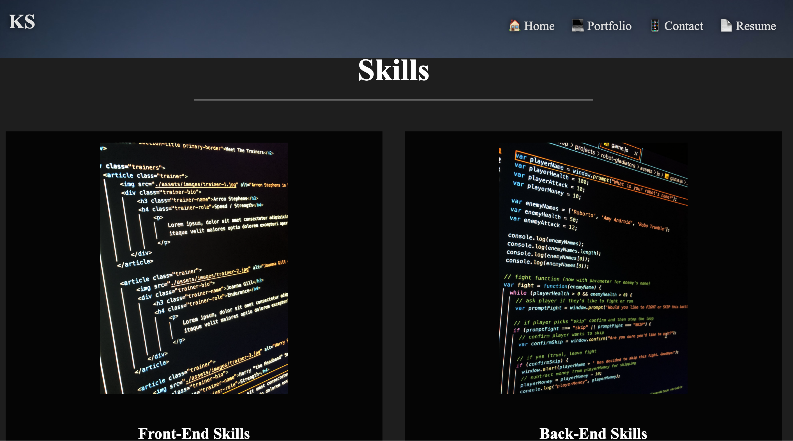
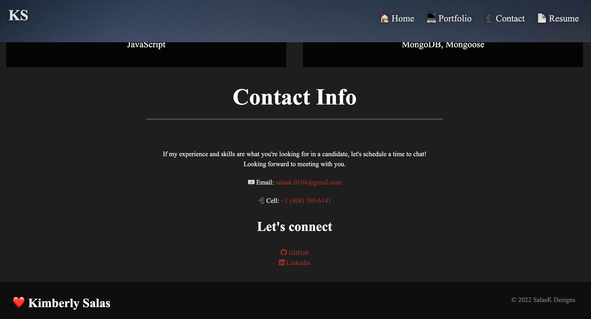

Description:

Created a responsive portfolio using HTML and CSS. I have ncluded my resume in the header that will open in a new tab, recent projects with links to github repo + live links/demos, and added more ways to reach out in the contact section.

Links and screenshots:

Github repo: https://github.com/salask24/digital-portfolio  
Portfolio: https://salask24.github.io/digital-portfolio/

